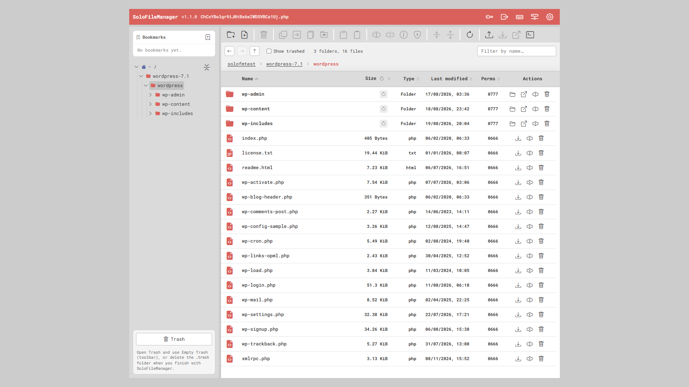
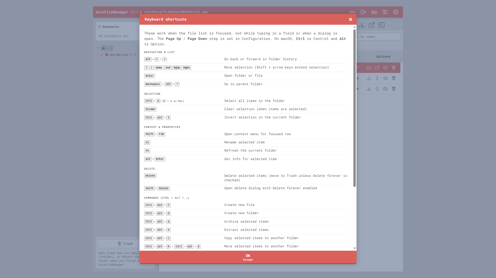
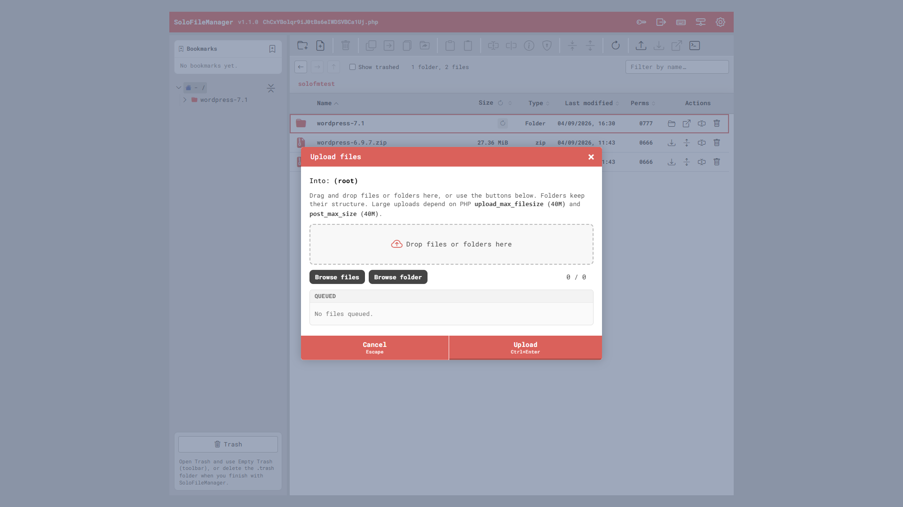
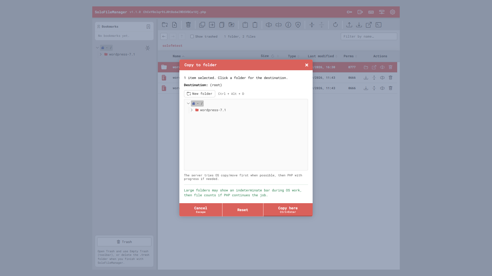
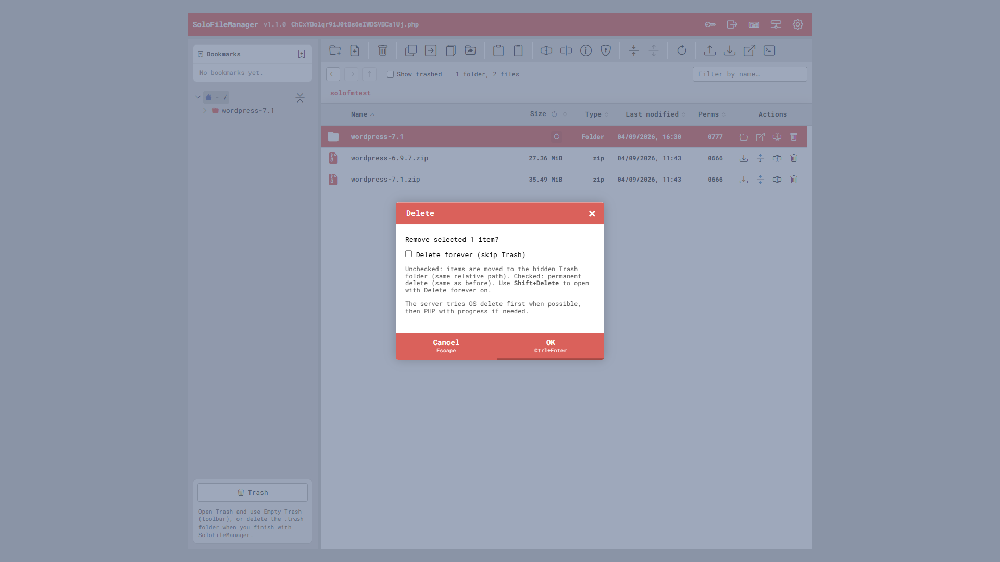
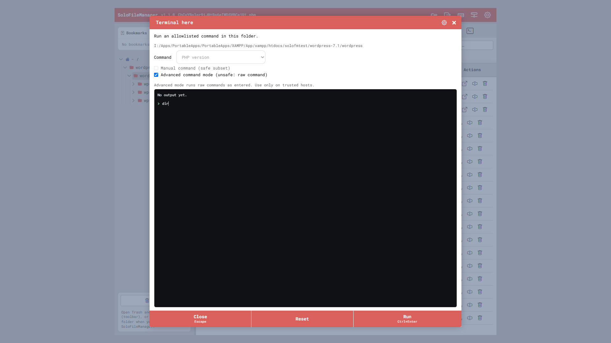
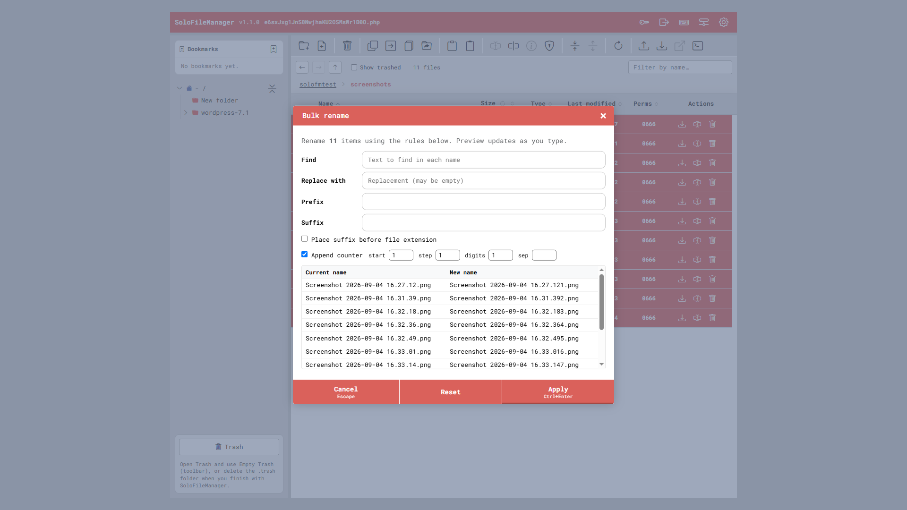
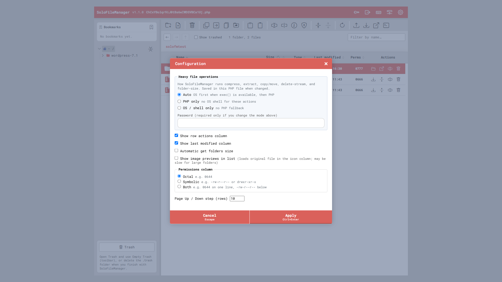
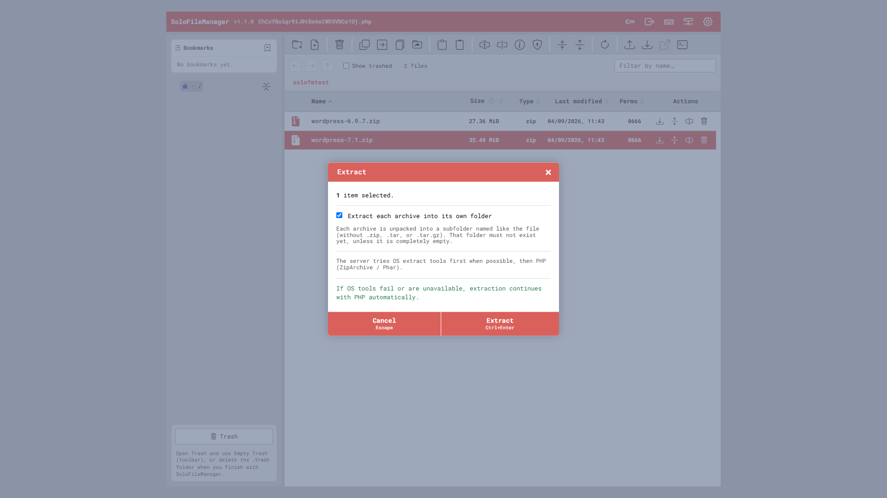
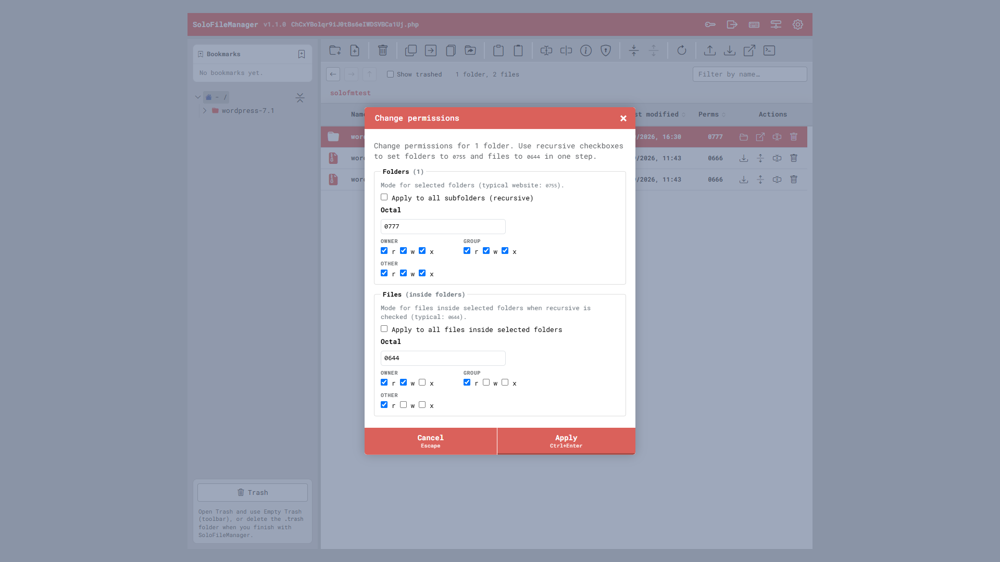

# SoloFileManager

### A powerful single-file PHP file manager for your server.

Manage files directly from your browser — without installing WordPress, Laravel, a database, Node.js or any other framework.

### One PHP file. No installation. No database.

Current version: **1.1.0**

## Why SoloFileManager?

- 🚀 Single PHP file
- 📦 No database required
- 🔧 Works on shared hosting, VPS and XAMPP
- 📁 Upload, download, copy, move and rename files
- 🗑️ Trash and restore
- 📦 ZIP compression and extraction
- 🔐 Built-in authentication
- 🖥️ Optional terminal
- ⚡ Fast and lightweight
- 🆓 MIT License

## Screenshots

<table>
    <tr>
        <td width="33%">
            
        </td>
        <td width="33%">
            
        </td>
        <td width="33%">
            
        </td>
    </tr>
    <tr>
        <td width="33%">
            
        </td>
        <td width="33%">
            
        </td>
        <td width="33%">
            
        </td>
    </tr>
    <tr>
        <td width="33%">
            
        </td>
        <td width="33%">
            
        </td>
        <td width="33%">
            
        </td>
    </tr>
    <tr>
        <td width="33%">
            
        </td>
        <td width="33%"></td>
        <td width="33%"></td>
    </tr>
</table>

## Quick start

1. Copy `solofilemanager.php` into the directory you want to manage (or into a web-accessible folder pointing at your target root).
2. Open it in the browser, e.g. `http://localhost/solofilemanager.php`
3. On first run, SoloFileManager asks you to **rename** the file. You can pick a pure random name (harder to find) or a `solofilemanager_`-prefixed name (easier to spot in the folder).
4. Log in with the default password **`admin`**. SoloFileManager then asks you to **set a new password** (new + confirm only — no need to retype `admin`). It tries to update `$PASSWORD_HASH` in the same PHP file; if the file is not writable, it shows a hash to paste manually. You can change the password later from the key icon in the header.

### Requirements

**PHP**

- PHP **7.4+** (`declare(strict_types=1)`)
- Extensions: **`json`**, **`session`** (required for the UI/API and login)
- **`mbstring`** recommended (better text encoding handling; SoloFileManager degrades without it)
- Archives (compress / extract / multi-download ZIP): **`zip`** (`ZipArchive`) and/or **`phar`** (`Phar` / `PharData`)
- **`exec()`** optional — when available and not in `disable_functions`, SoloFileManager can use OS tools for faster copy/move/delete/compress/extract/folder-size (`$FM_FILE_OPS_MODE = 'auto'`). Without `exec()`, use `'php'` mode (or leave `'auto'` and rely on PHP fallbacks)

**Filesystem**

- The web server user must be able to **read** `$ROOT_DIR` and **write** where you create/upload/rename/delete files
- First-run self-rename needs write permission on the directory that contains `solofilemanager.php`
- Trash uses a hidden folder under root (default `.trash`); that path must be creatable/writable
- When you finish with SoloFileManager, **empty Trash** or delete the trash folder (default `.trash`) so removed files are not left on the server

**Browser & network**

- A modern browser with **JavaScript** enabled
- Default UI loads **CDN** assets (Normalize CSS, Bootstrap Icons, Google Fonts). Offline or locked-down hosts need network access to those CDNs, or you must vendor the assets yourself

**Operating system notes**

- Full feature set (especially **chmod** / Unix permissions) works best on **Linux** and similar hosts
- On **Windows** (e.g. XAMPP), file management still works; permission bits are limited by the OS, and some shell/archive helpers may differ

## Features

- Folder tree (sidebar) with bookmarks and trash
- File/folder listing with sortable columns
- Create folder/file, rename, bulk rename, duplicate
- Copy / move with progress; drag and drop
- Delete to trash (recycle) or delete forever; restore; Empty Trash (with confirm); cleanup reminders in the Trash UI
- Filter the current folder listing by name (search field in the breadcrumb bar)
- Compress / extract archives
- Change permissions (chmod) for folders and files, including recursive 0755 / 0644 style fixes
- Upload, download, get info, copy paths
- Configuration popup (columns, permissions display, folder-size behavior, heavy file-ops mode)
- Change password from the UI (updates `$PASSWORD_HASH` in the same PHP file when writable)
- Keyboard shortcuts, server info
- Optional terminal-here (disabled by default — open the terminal icon for Terminal settings: Standard / Manual / Advanced, password to save; gear inside the terminal popup; or edit the `$FM_ENABLE_TERMINAL_*` flags; trusted hosts only)

## Configuration

Edit the config block at the top of `solofilemanager.php`:

| Setting | Purpose |
|---------|---------|
| `$ROOT_DIR` | Root path users may browse (default: script directory) |
| `$ENABLE_AUTH` / `$PASSWORD_HASH` | Session login (keep auth on). Prefer changing the password in the UI (key icon); manual hash paste is the fallback |
| `$FM_FILE_OPS_MODE` | `'auto'`, `'php'`, or `'os'` for heavy file operations. Prefer changing from **Configuration** (password to save); file edit is the fallback |
| `$FM_VERBOSE_PROGRESS_MIN_ITEMS` | When to show detailed progress for large jobs |
| `$FM_TRASH_BASENAME` | Hidden recycle folder under root (default `.trash`) |
| `$FM_ENABLE_TERMINAL_HERE` | Standard terminal-here (**false** by default). Prefer Terminal settings from the terminal icon (password); or set `true` in the file on trusted hosts only |
| `$FM_ENABLE_TERMINAL_MANUAL` / `$FM_ENABLE_TERMINAL_ADVANCED` | Manual / advanced modes (**false** by default). Same Terminal settings UI (gear in the terminal popup), or edit the file |

Manual password-hash recovery (only if the in-app update cannot write the file):

```php
echo password_hash('your-strong-password', PASSWORD_DEFAULT);
```

Paste the result into `$PASSWORD_HASH` near the top of the script.

## Security

SoloFileManager can create, rename, and delete files. Treat it as **high risk** if exposed on the public internet.

- Keep `$ENABLE_AUTH = true` and change the default `admin` password on first login
- Do not rely on the random filename alone
- Prefer HTTPS, IP allowlists, and/or HTTP Basic Auth at the web server

See [SECURITY.md](SECURITY.md) for more.

## Changelog

### 1.1.0

- Filter current folder by name (search field in the breadcrumb bar)
- Empty Trash (toolbar confirm + API); clearer Restore visibility with Show trashed
- Delete forever confirm for dimmed trashed rows; archive overwrite confirm
- Faster folder size via OS tools when `exec()` / file-ops mode allows
- Keyboard shortcut labels on actions; F5 refresh; extract syncs sidebar tree
- Scrollbars: show on hover (fine pointer); always visible on touch
- Fix: restore / empty trash update the sidebar without a full tree reload (avoids lag)

### 1.0.2

- Fix: after changing password from the header, the page reloads as promised
- Docs: clarify setup, Configuration (file-ops mode), and terminal settings UX

### 1.0.1

- Dual first-run rename suggestions (random / `solofilemanager_` prefix)
- In-app password change and Terminal settings (Standard / Manual / Advanced)
- Configuration can set `$FM_FILE_OPS_MODE` with password confirmation

## License

MIT — see [LICENSE](LICENSE). Others may use, modify, and redistribute SoloFileManager (including commercially), as long as they keep the copyright and license notice. The software is provided **as is**, without warranty.
